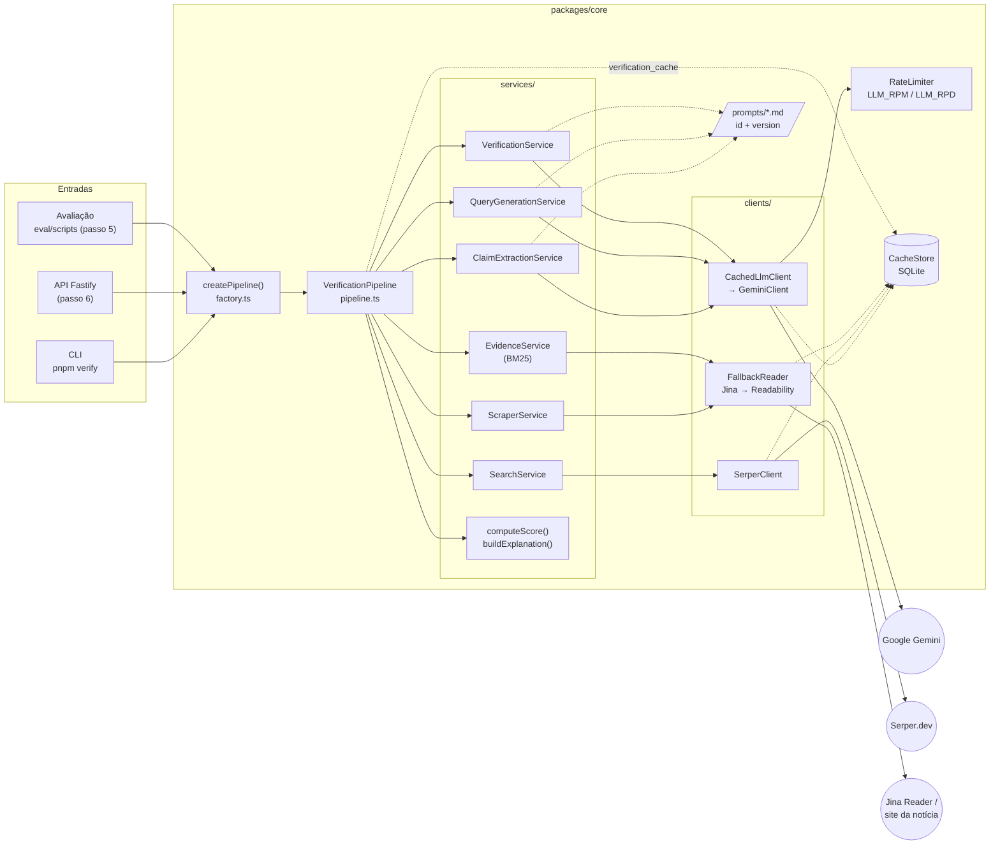

# Arquitetura de componentes — `@veritasai/core`

```mermaid
flowchart LR
  subgraph Entradas
    CLI["CLI<br/>pnpm verify"]
    API["API Fastify<br/>(passo 6)"]
    EVAL["Avaliação<br/>eval/scripts (passo 5)"]
  end

  subgraph Core["packages/core"]
    FACTORY["createPipeline()<br/>factory.ts"]
    PIPE["VerificationPipeline<br/>pipeline.ts"]

    subgraph Servicos["services/"]
      SCR[ScraperService]
      CE[ClaimExtractionService]
      QG[QueryGenerationService]
      SS[SearchService]
      EV["EvidenceService<br/>(BM25)"]
      VS[VerificationService]
      SC["computeScore()<br/>buildExplanation()"]
    end

    subgraph Clientes["clients/"]
      LLM["CachedLlmClient<br/>→ GeminiClient"]
      SER[SerperClient]
      RD["FallbackReader<br/>Jina → Readability"]
    end

    RL["RateLimiter<br/>LLM_RPM / LLM_RPD"]
    CACHE[("CacheStore<br/>SQLite")]
    PROMPTS[/"prompts/*.md<br/>id + version"/]
  end

  CLI & API & EVAL --> FACTORY --> PIPE
  PIPE --> SCR & CE & QG & SS & EV & VS & SC
  SCR --> RD
  EV --> RD
  CE & QG & VS --> LLM
  CE & QG & VS -.-> PROMPTS
  SS --> SER
  LLM --> RL
  LLM & SER & RD -.-> CACHE
  PIPE -.->|verification_cache| CACHE

  LLM --> GEM(("Google Gemini"))
  SER --> SERPER(("Serper.dev"))
  RD --> JINA(("Jina Reader /<br/>site da notícia"))
```
