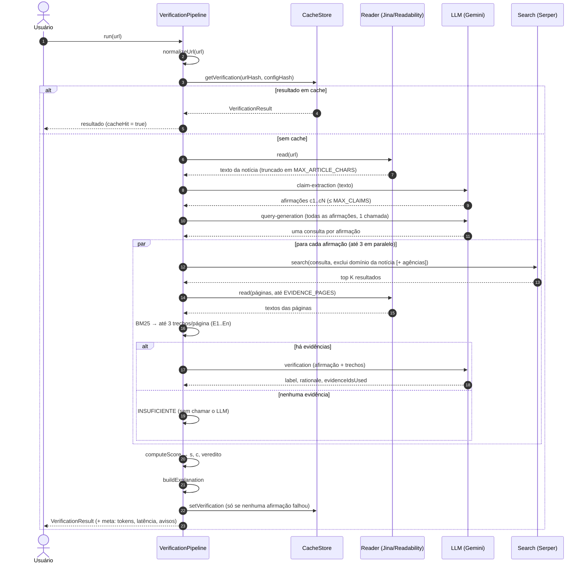

# Sequência de uma verificação

```mermaid
sequenceDiagram
  autonumber
  actor U as Usuário
  participant P as VerificationPipeline
  participant C as CacheStore
  participant R as Reader (Jina/Readability)
  participant L as LLM (Gemini)
  participant S as Search (Serper)

  U->>P: run(url)
  P->>P: normalizeUrl(url)
  P->>C: getVerification(urlHash, configHash)
  alt resultado em cache
    C-->>P: VerificationResult
    P-->>U: resultado (cacheHit = true)
  else sem cache
    P->>R: read(url)
    R-->>P: texto da notícia (truncado em MAX_ARTICLE_CHARS)
    P->>L: claim-extraction (texto)
    L-->>P: afirmações c1..cN (≤ MAX_CLAIMS)
    P->>L: query-generation (todas as afirmações, 1 chamada)
    L-->>P: uma consulta por afirmação

    par para cada afirmação (até 3 em paralelo)
      P->>S: search(consulta, exclui domínio da notícia [+ agências])
      S-->>P: top K resultados
      P->>R: read(páginas, até EVIDENCE_PAGES)
      R-->>P: textos das páginas
      P->>P: BM25 → até 3 trechos/página (E1..En)
      alt há evidências
        P->>L: verification (afirmação + trechos)
        L-->>P: label, rationale, evidenceIdsUsed
      else nenhuma evidência
        P->>P: INSUFICIENTE (sem chamar o LLM)
      end
    end

    P->>P: computeScore → s, c, veredito
    P->>P: buildExplanation
    P->>C: setVerification (só se nenhuma afirmação falhou)
    P-->>U: VerificationResult (+ meta: tokens, latência, avisos)
  end
```
